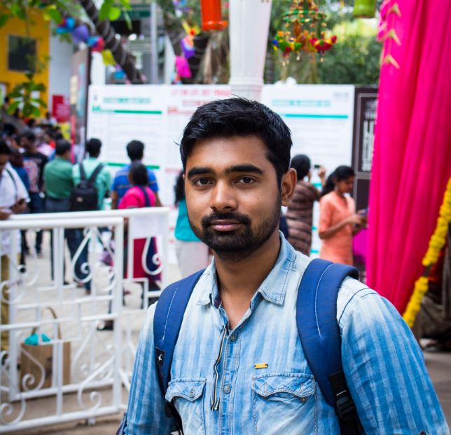

		
# Debasish Ray Mohapatra #

Hello everyone, my name is Deb and I am a graduate student (MASc) in [Electrical and Computer Engineering](http://www.ece.ubc.ca/) at the University of British Columbia, Canada, advised by [Sidney Fels](https://www.ece.ubc.ca/faculty/sid-fels) and [Victor Zappi](https://toomuchidle.com/). Currently, I am affiliated with [HCT Lab](http://hct.ece.ubc.ca/).

Previously, I obtained my B.E. in Electronics and Communication Engineering (ECE) department from [S'O'A University](https://www.soa.ac.in/iter). Before coming to UBC, I worked as a software test engineer at [Tata Consultancy Services](https://www.tcs.com/) for three years.

I am modelling a **human vocal tract** that could help us in designing a **real-time articulatory speech synthesis**. To know more about my research, check my publications [here](/projects).

Outside of research, I love [running](https://www.strava.com/athletes/45967561) and [street photography](https://500px.com/debasishraymohapatra). Occasionally, I write in [Odia](/mywriting). 
			
Email: `d_dot_mohapatra_at_alumni_dot_ubc_dot_ca`
